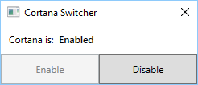

# Cortana Switcher

Enable/Disable Cortana in Windows 10 Anniversary Update (Redstone 1).

This tool edits the registry and so requires Administrator privileges. For details, see the following article.

 - [How to Disable Cortana in Windows 10’s Anniversary Update](http://www.howtogeek.com/265027/how-to-disable-cortana-in-windows-10/).

## Download

:floppy_disk: [Download](https://github.com/emoacht/CortanaSwitcher/releases/download/0.1/CortanaSwitcher01.zip)

## Licence

 - MIT License
